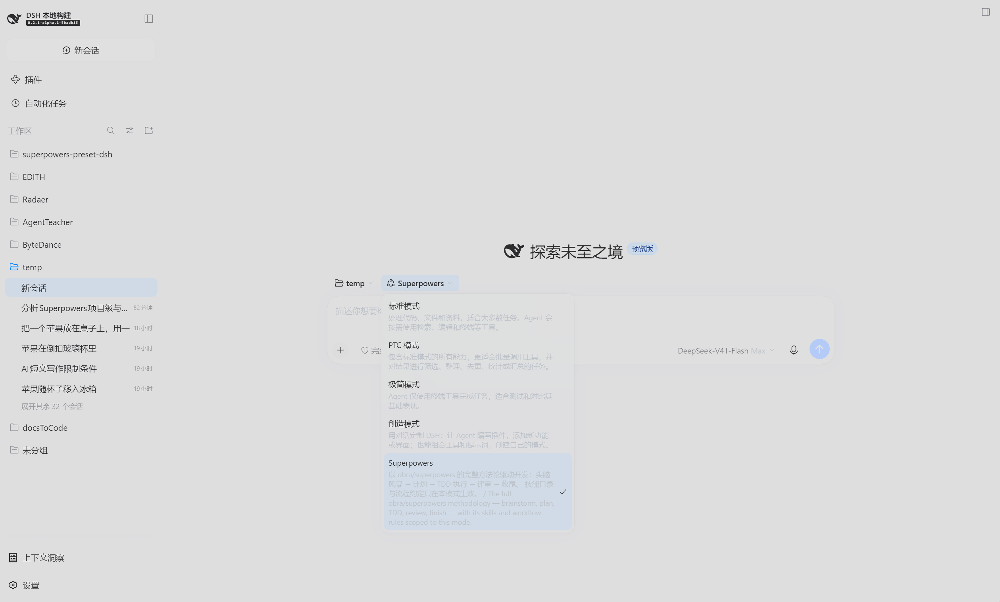

<div align="center">

[简体中文](README.md) | **English**

# superpowers-preset-dsh

The complete [obra/superpowers](https://github.com/obra/superpowers) development
methodology, packaged as a **DeepSeek Harness (DSH) agent preset**.

Chosen per task, scoped per task: the workflow rules go into the system prompt,
and the skill catalog is visible only in this mode.

[](LICENSE)
[](#compatibility)
[](https://github.com/obra/superpowers)
[](package.json)



</div>

---

## The problem it solves

Install Superpowers as a **plugin** and its skills register into the host layer,
so *every* session in the profile — including ones with nothing to do with
coding, and ones following a different workflow — carries that skill catalog in
its system prompt. That is both a token cost and a potential workflow conflict.

This project takes the other road: Superpowers as an **agent preset** — a
selectable *mode*.

| | Plugin | This preset |
| --- | --- | --- |
| Who sees the skills | Every session in the profile | Only tasks started in this mode |
| Catalog tokens when unused | Paid in every session | Zero |
| How the rules reach the model | Depends on the plugin (session-start context, or the catalog description alone) | This mode's system prompt, re-sent on every request |
| After context compaction | Text injected at session start can be trimmed | Unaffected: the system prompt is not conversation history |
| Turning it off | Disable/remove the plugin and restart | Pick another mode for the next task |

They answer different questions and neither is better in the abstract; the
tradeoffs are laid out in [Compared with the plugin approach](docs/plugin-vs-preset.md).

## Install

> **One word of clarification first.** `dsh plugin add` is DSH's **installation
> channel**, and what it installs is a **bundle** — an ordinary npm package that
> declares a `dsh.bundle.patch`. What that bundle becomes at runtime is entirely
> up to what its patch contains.
>
> This package inserts **one agent-preset declaration** into the profile's
> composition and mounts nothing at the host layer. So the accurate description
> is "**a preset installed through the plugin channel**", not "a plugin". The only
> code it ships is `lib/skills.js`, mounted as a **child row of the preset**, which
> is why it registers into the preset's own skill layer. The reasoning is in
> [How it works](#how-it-works).

### Option 1 — let DSH install it

Start a conversation in DSH and send:

```
Install this plugin for me: https://github.com/EdouardRichard/superpowers-preset-dsh
```

It will install the bundle and restart the profile; refresh your browser
afterwards.

### Option 2 — the command line

```sh
dsh plugin --profile web add github:EdouardRichard/superpowers-preset-dsh
```

Without a global `dsh`, use `npx`:

```sh
npx @deepseek-ai/dsh plugin --profile web add github:EdouardRichard/superpowers-preset-dsh
```

Replace `--profile` with the profile you actually run (`web`, `headless`, or your
own).

### Option 3 — from a local checkout

```sh
git clone https://github.com/EdouardRichard/superpowers-preset-dsh
dsh plugin --profile web add ./superpowers-preset-dsh
```

A local directory installs as a **link**, not a copy, so your edits take effect on
the next profile restart — convenient while customising.

### A restart is required

Bundle layers mount at profile start, so **restart the profile** (stop it and run
`dsh web` again), then refresh the browser.

### Confirm it installed

```sh
dsh --profile web --dump-config | grep superpowers-preset-dsh
```

You should see the `- id: preset-superpowers` block, including the line
`name: superpowers-preset-dsh/skills`.

### Uninstall

```sh
dsh plugin --profile web remove superpowers-preset-dsh
```

A restart is required here too.

## Use

Start a new task, switch the mode selector above the composer to
**Superpowers**, and describe the work normally.

- **You do not need to remember skill names.** The agent loads them by rule: if a
  skill clearly applies, it loads it with the `skill` tool before acting.
- **You can name one.** Type a slash command such as `/brainstorming`,
  `/writing-plans`, or `/test-driven-development`, or just ask for it.
- **Switching back is free.** The mode affects the current task only; pick
  Standard for the next one.

## Mode details / How to use

The four built-in DSH presets (Standard, PTC, Minimal, Creator) show **Mode
details** and **How to use** buttons on their cards. **A third-party preset
cannot get those buttons** — that is how DSH is currently implemented, not a
configuration mistake: the help lookup is open only to built-in presets with
`trust === 'system'`, and only four hardcoded ids ever match (see
[the evidence](docs/guide.en.md#why-the-card-has-no-such-buttons)).

So that content ships as documentation instead:

- **[Mode details and how to use (English)](docs/guide.en.md)**
- **[模式说明与如何使用（中文）](docs/guide.zh.md)**

A condensed version follows.

### Mode details (condensed)

**How it works.** The 15 Superpowers skills are registered into this preset's own
skill layer, and the body of `using-superpowers` enters the system prompt as this
mode's persona. Plan mode, subagents, workflows, goals, context compaction, a
terminal, and file read/write/search are all mounted, so the mode can carry a
task from idea to commit on its own.

**Five stages.** Think it through (`brainstorming`) → plan it (`writing-plans`) →
execute it (`subagent-driven-development` / `executing-plans`) → debug it
(`systematic-debugging` / `test-driven-development`) → finish it
(`verification-before-completion` / `requesting-code-review` /
`finishing-a-development-branch`).

**Choose it when** you are shipping code — features, bug fixes, refactors — or
you want the agent to settle requirements and design before writing, or the task
is long enough to need a plan and a ledger.

**Choose something else when** the task is not about code (Standard mode saves
the tokens), you want a one-line change without a process, or you need a
comparison baseline (Minimal mode).

### How to use (condensed)

Pick the mode and describe the task:

> I want to add an "export to CSV" feature to this CLI, but I have not settled the
> argument design. Talk the requirements and boundaries through with me first,
> give me two or three options to compare, and only write code after I confirm.

> Occasionally an order gets charged twice after submit. Find the root cause
> first — do not patch yet. Once you have it, write a failing test that
> reproduces it, then fix it, run the relevant tests, and explain the cause.

> Review the changes on this branch. Focus on potential bugs and test gaps, and
> cite file paths and line numbers. Do not modify files yet.

Each example states its expected output; all six are in
[How to use](docs/guide.en.md#2-how-to-use-it).

## Skills

Skill content is synced from upstream **obra/superpowers v6.4.2**, with the
instructions that name tools, paths, subagents, or scripts rewritten for DSH.

| Skill | Purpose |
| --- | --- |
| `using-superpowers` | Entry point: how to find skills and when you must load one |
| `brainstorming` | Turn an idea into a design you approved, through dialogue |
| `writing-plans` | Break a spec into small independently verifiable tasks |
| `executing-plans` | Drive a plan from a ledger in the current context, one review at the end |
| `subagent-driven-development` | A fresh implementer and an independent reviewer per task |
| `dispatching-parallel-agents` | Fan independent work out concurrently |
| `systematic-debugging` | Four-phase root-cause-before-fix discipline |
| `test-driven-development` | The RED-GREEN-REFACTOR implementation loop |
| `verification-before-completion` | Evidence before any success claim |
| `requesting-code-review` | Get a strict review before merging |
| `receiving-code-review` | Verify feedback instead of performing agreement |
| `finishing-a-development-branch` | Integrate finished work safely |
| `using-git-worktrees` | An isolated workspace for feature work |
| `writing-skills` | Author and validate new skills TDD-style |
| `diagnosing-superpowers` | Read the on-disk transcript and report with `file:line` evidence |

## How it works

In one sentence: `cordis.patch.yml` inserts **one** agent-preset declaration into
the profile's composition, and the skill provider mounted inside it is
`superpowers-preset-dsh/skills`, so it registers into **that preset's own scope**
rather than the host's global layer.

```
cordis.patch.yml
└── preset-superpowers  (@deepseek-ai/dsh-agent-preset)
    ├── persona                                 ← using-superpowers body into the system prompt
    ├── superpowers-preset-dsh/skills           ← 15 skills, registered into this preset's layer only
    ├── tool-skill                              ← the catalog and the skill loader
    └── terminal / fs / search / plan / compaction / subagents / workflow / goal / todo / web
```

The full explanation — why the bootstrap is a persona rather than a session-start
injection, and why the provider is a subpath export rather than the package root —
is in [docs/architecture.md](docs/architecture.md).

## Customising

Every row of the preset can be overridden from your own profile patch: rename the
mode, move it up the roster, or drop tools you do not want.

```yaml
# Append to $DSH_HOME/profiles/<your-profile>/cordis.patch.yml
- id: preset-superpowers
  name: '@deepseek-ai/dsh-agent-preset'
  config:
    id: superpowers
    name: Superpowers (mine)
    description: My own description.
    order: 2
    plugins:
      # `config` is replaced wholesale, never deep-merged: copy the plugin list
      # from cordis.patch.yml above, then add or remove rows.
      - id: persona
        name: '@deepseek-ai/dsh-persona'
        config:
          prefix: |-
            ...keep it as-is, or write your own...
          suffix: Your working directory is {{cwd}}.
      # ...
```

A copy-pasteable skeleton is in
[examples/profile-override.patch.yml](examples/profile-override.patch.yml).

## Upstream sync

`skills/` is a **generated** tree. Do not hand-edit it. The sync logic lives in
scripts, and every rewrite is asserted:

```sh
# 1. fetch the pinned upstream checkout
mkdir -p .upstream && curl -L \
  https://codeload.github.com/obra/superpowers/tar.gz/refs/tags/v6.4.2 \
  | tar -xz -C .upstream --strip-components=1

# 2. replay the port (also re-renders the persona text in cordis.patch.yml)
npm run sync -- .upstream

# 3. gate it
npm run verify
```

If upstream changes text an adaptation depends on, `npm run sync` **fails and
leaves `skills/` untouched** instead of silently dropping a DSH adaptation. The
adaptation list is in [NOTICE.md](NOTICE.md).

## Compatibility

| | Status |
| --- | --- |
| DSH versions verified | `0.2.1-alpha.1` (installed) and source checkout `5badb15` |
| DSH interfaces used | `ctx.skills.registerProvider`, `dsh.bundle.patch`, the `@deepseek-ai/dsh-agent-preset` declaration format, `@deepseek-ai/dsh-persona` |
| Runtime dependencies | **None.** Node built-ins only |
| peerDependencies | **None declared.** DSH's plugin compatibility gate only inspects the peer dependencies a plugin declares, so it will not block this bundle — at the cost of DSH not validating it for you. Re-run `npm run verify` after a DSH upgrade |
| Node.js | >= 20 (verified on 24.x) |
| Platforms | Windows, macOS, Linux. On Windows `tool-pwsh` is mounted; on POSIX, `tool-bash` |

### Known limitations

- **No Mode details / How to use buttons on the card** — see above; the
  equivalent content is in [docs/guide.en.md](docs/guide.en.md).
- **Subagents cannot pin a model.** DSH's `subagent` tool accepts only
  `description`, `prompt`, and `run_in_background`. Where
  `subagent-driven-development` says "always specify the model explicitly", the
  DSH translation is to state it in the prompt; when per-unit model control
  matters, use `workflow`, whose `agent()` accepts `provider` and `model`.
- **No named agents.** Upstream's `Task(superpowers:code-reviewer)` has no DSH
  equivalent; dispatch the skill's own prompt template (`code-reviewer.md`, …)
  through `subagent` instead.
- **bash helper scripts.** Seven `.sh` scripts need Git Bash. On Windows, `bash`
  on `PATH` is often `WindowsApps\bash.exe` — a 0-byte WSL stub, not Git Bash.
  Run `Get-Command bash -All` before relying on it. The Node helpers are
  unaffected.
- **`writing-skills/render-graphs.js` needs graphviz `dot`.** Skip the render if
  it is not installed.

## Verification

The static gate, which needs no installation (this is what CI runs):

```sh
npm run verify
```

It checks that the bundle manifest resolves, the preset declaration is
well-formed, the persona text matches the skill file byte for byte, all 15 skills
list and load through the real provider, and no relative link dangles.

End-to-end, in a throwaway profile:

```sh
# Use a disposable profile; do not touch your own
dsh --profile sptest --from-default-profile web --dump-config > /dev/null
dsh plugin --profile sptest add ./superpowers-preset-dsh
dsh --profile sptest --port 3099 --no-open
```

Then start one task in **Superpowers** and one in **Standard**, and compare the
transcripts:

- the Superpowers task's system prompt contains the `using-superpowers` body, and
  its skill catalog lists all 15 skills;
- the Standard task's system prompt does not, and its catalog does not.

That is exactly how `1.0.0` was verified.

## License and credits

MIT. The skill content is adapted from
[obra/superpowers](https://github.com/obra/superpowers) (MIT, © 2025 Jesse
Vincent); the full third-party notice, the upstream licence text, and the
adaptation list are in [NOTICE.md](NOTICE.md).

The upstream project, DSH, and
[superpowers-dsh](https://github.com/LayneChai/superpowers-dsh) — the first port
of Superpowers to DSH — are all worth your time. This project is not affiliated
with any of them.
